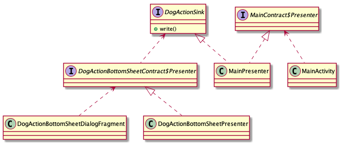

## 補項: Custom Scope (実装)

Positive
: `Custom Scope (事前準備)` に引き続き Custom Scope について解説します。ここからは Custom Scope を実際に使ってみます。

先程の章ではコードレベルでは問題のない実装を行いましたが、実際はうまく動きませんでした。
その理由を後ほど説明しつつ、Custom Scopeを実装していきます。

### Custom Scopeの作成

この章で最重要の `Scope` アノテーションを実装しますが、内容は極めてシンプルです。

今回は`Activity`のための`Scope`として`ActivityScope`、`Fragment`のための`Scope`として`FragmentScope`を定義します。

`<srcBasePath>/di/ActivityScope.kt` を以下の内容で実装します。

```kt
@Scope
@MustBeDocumented
@Retention(AnnotationRetention.RUNTIME)
annotation class ActivityScope
```

`<srcBasePath>/di/FragmentScope.kt` を以下の内容で実装します。

```kt
@Scope
@MustBeDocumented
@Retention(AnnotationRetention.RUNTIME)
annotation class FragmentScope
```

Positive
: これらのCustomScopeの名称としては他には `@PerActivity`, `@PerFragment` と名付ける流派もあります。また [google/iosched](https://github.com/google/iosched) 2019年版では [`@ActivityScoped`](iosched/ActivityScoped.java at master · google/iosched https://github.com/google/iosched/blob/7935c28f249f32786ccc53bc0098d073065b1ec5/shared/src/main/java/com/google/samples/apps/iosched/shared/di/ActivityScoped.java), [`@FragmentScoped`](https://github.com/google/iosched/blob/7935c28f249f32786ccc53bc0098d073065b1ec5/shared/src/main/java/com/google/samples/apps/iosched/shared/di/FragmentScoped.kt) と名付けられています。


### Custom Scopeアノテーションの付与

`MainActivity`のSubComponentに`ActivityScope`を付加します。

```kt
@Module
interface MainActivityModule {
    @ActivityScope // 👈
    @ContributesAndroidInjector(...)
    fun contributeMainActivity(): MainActivity
}
```

続いて`DogActionBottomSheetDialogFragment`には`FragmentScope`を付加します。

```kt
@Module
interface DogActionBottomSheetDialogFragmentModule {
    @FragmentScope // 👈
    @ContributesAndroidInjector
    fun contributeDogActionBottomSheetDialogFragment(): DogActionBottomSheetDialogFragment
}
```

### `MainPresenter` / `DogActionSink`



先程のクラス図を見ると`DogActionSink`というinterfaceがあることに気づくでしょう。
今回はこのinterfaceの`write`を呼び出すことで、シェアリストへの追加を実現します。
この`DogActionSink`の実体は`MainPresenter`です。

ここで考えるべきこととして、今の状態では`MainPresenter`のインスタンスを毎回生成するため、`DogActionSink`をいくら呼び出したとしても、`MainActivity`から見えるシェアリストは空であるということです。
`MainActivity`から参照される`MainContract$Presenter`、`DogActionBottomSheetPresenter`から参照される`DogActionSink`、これらはすべて同じインスタンスである必要があります。 (混乱するかもしれませんが、`MainContract$Presenter`と`DogActionSink`の実体は同じ`MainPresenter`です。)

この課題を解決できるのが`Scope`です。
まずは`MainPresenter`に`ActivityScope`を **付加せずに** アプリの動作を試してみてください。

```kt
class MainPresenter @Inject constructor(
    private val view: MainContract.View
) : MainContract.Presenter, DogActionSink {
```

`MainPresenter#write`あたりにbreakpointを置いて確認してみると、Bottom sheetから参照される`MainPresenter`が毎回生成されていることが分かるでしょう。

それでは`MainPresenter`に`ActivityScope`を付加してみましょう。

```kt
@ActivityScope
class MainPresenter @Inject constructor(
    private val view: MainContract.View
) : MainContract.Presenter, DogActionSink {
```

今度はインスタンスが保持され、期待した挙動になっていることが確認できます。

Positive
: 実はこのプロジェクトでは`@FragmentScope`は未使用でした。Subcomponentには `@FragmentScope` をつけていますが、Fragmentのライフサイクルで管理されるべきクラスがなかったためです。なにか考えて作ってみてもいいかもしれません。

### まとめ

このチャプターでは`Custom Scope`の使い方について実際に挙動を見ながら確認していきました。

Scopeの章と見比べると、実際にインスタンス管理をしたいクラスに加えてSubcomponentに対して同じアノテーションを付与するということを理解すれば、実装すること自体は簡単だということが分かります。

最近ではMVVMを採用する場合には`androidx.lifecycle.ViewModelProvider`もあるため`Scope`が必要な機会はかなり少なくなってきているかとは思いますが、Fluxなどを採用する場合には有効な知識です。

